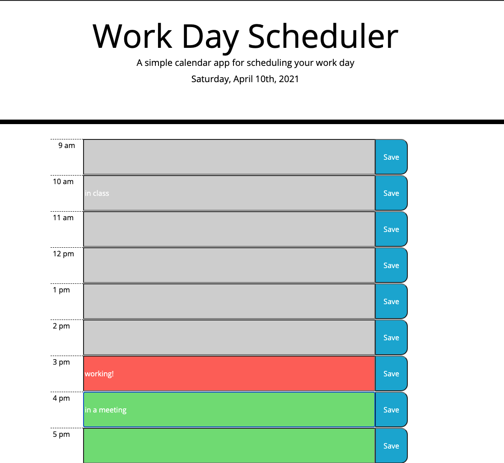

# Work Day Planner

URL: https://cristina-gorrino.github.io/work-day-planner/

Purpose: To create a day planner app that stores an agenda of events for the current day.

## Description

This app is a day planner that allows a user to keep an agenda of events in hourly time-slots during the standard workday. The current date is displayed at the top of the page. There are time blocks every hour from 9am to 5pm that are colored to reflect future hours, past hours, or the hour currently in progress. The user can click into any of these blocks, type some text, like an event, and save it. The saved events persist in local storage so they can be displayed at any point. The client can also edit and re-save any event.

## Visuals

Below are some examples of the look and functionality of this app.

